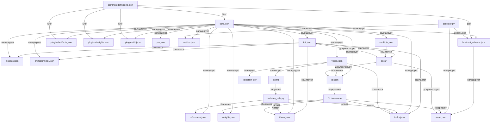

# Диаграмма взаимодействий документов LLMstruct

**Статус**: Черновик  
**Версия**: 0.2.0  
**Автор**: @kpblcaoo  
**Дата**: 2025-05-22  
**Лицензия**: GPL-3.0  

## Обзор

Этот документ содержит диаграмму и пояснения, как взаимодействуют файлы LLMstruct (JSON-схемы, данные, скрипты, CI, документация). Охватывает валидацию, генерацию, CLI, API, CI/CD и ссылки в документации, отражая задачи TSK-006, TSK-119, TSK-126, TSK-035 и PRO-004.

## Диаграмма

Диаграмма использует Mermaid для отображения взаимодействий. Стрелки показывают направление и тип связи (например, валидация, генерация).

## Пояснения

Ниже приведены взаимодействия, сгруппированные по типам файлов, с описанием назначения и примерами.

### Схемы (`schema/*`)
1. **core.json → валидирует все JSON-файлы**:
   - **Файлы**: `tasks.json`, `ideas.json`, `insights.json`, `artifacts/index.json`, `llmstruct_schema.json`, `plugins/*.json`, `weights.json`, `prs.json`, `cli.json`, `metrics.json`, `conflicts.json`, `references.json`, `vision.json`, `init.json`.
   - **Назначение**: Гарантирует наличие обязательных полей (`metadata`, `version`, `artifact_id`) и лицензии GPL-3.0.
   - **Пример**: `tasks.json` должен иметь `metadata.project_name = "llmstruct"`.
2. **common/definitions.json → $ref в схемах**:
   - **Файлы**: `core.json`, `llmstruct_schema.json`, `plugins/artifacts.json`, `plugins/insights.json`, `plugins/cli.json`.
   - **Назначение**: Предоставляет повторно используемые определения (`artifact_id`, `metadata`, `module`, `artifact`).
   - **Пример**: `core.json` использует `$ref: "common/definitions.json#/definitions/artifact_id"`.
3. **llmstruct_schema.json → валидирует struct.json**:
   - **Файл**: `struct.json`.
   - **Назначение**: Определяет структуру проектного JSON (`toc`, `modules`, `folder_structure`, `filters`).
   - **Пример**: `struct.json` содержит `filters: ["src/*", "!tests/*"]`.
4. **plugins/artifacts.json → валидирует artifacts/index.json**:
   - **Назначение**: Обеспечивает формат индексации артефактов.
   - **Пример**: `artifacts/index.json` перечисляет `cli.json` с `artifact_id`.
5. **plugins/insights.json → валидирует insights.json**:
   - **Назначение**: Структурирует находки (например, `INS-001`).
   - **Пример**: `insights.json` имеет `priority: "high"`.
6. **plugins/cli.json → валидирует cli.json**:
   - **Назначение**: Определяет структуру команд CLI.
   - **Пример**: `cli.json` перечисляет команду `parse` с `arguments`.

### Файлы данных (`data/*`)
7. **init.json → ссылается на основные файлы и документацию**:
   - **Файлы**: `tasks.json`, `ideas.json`, `insights.json`, `artifacts/index.json`, `docs/*`.
   - **Назначение**: Направляет пользователей к ключевым файлам и примерам использования.
   - **Пример**: `init.json` перечисляет `core_files: ["data/tasks.json"]`.
8. **tasks.json ↔ ideas.json (через references.json)**:
   - **Назначение**: Связывает задачи (например, `TSK-006`) с идеями (например, `IDEA-001`) для отслеживания.
   - **Пример**: `references.json` сопоставляет `IDEA-001` с `TSK-006` (`type: "dependency"`).
9. **weights.json ← CLI-команды**:
   - **Назначение**: Хранит приоритеты задач/идей (TSK-035).
   - **Пример**: `llmstruct weights adjust TSK-006 --weight 0.9` обновляет `weights.json`.
10. **prs.json ← ideas.json**:
    - **Назначение**: Отслеживает пул-реквесты (например, `PR-001` для `IDEA-126`).
    - **Пример**: `prs.json` связывает `pr_id: "PR-001"` с `idea_id: "IDEA-126"`.
11. **cli.json → определяет CLI-команды**:
    - **Назначение**: Задаёт команды (`parse`, `interactive`) для CLI (TSK-126).
    - **Пример**: `cli.json` определяет `parse` с аргументом `filters`.
12. **metrics.json ← collector.py, CLI**:
    - **Назначение**: Отслеживает статистику проекта (например, `code_lines`).
    - **Пример**: `collector.py` обновляет `metrics.json` с `code_lines: 1000`.
13. **conflicts.json → ссылается на документацию**:
    - **Назначение**: Регистрирует проблемы документации.
    - **Пример**: `conflicts.json` указывает на `llmstruct_format.md` для `CONF-001`.
14. **references.json ← validate_refs.py**:
    - **Назначение**: Поддерживает перекрёстные ссылки (TSK-006).
    - **Пример**: `validate_refs.py` обновляет `references.json` для `IDEA-001 → TSK-006`.
15. **vision.json → планирует CI/CD, Telegram**:
    - **Файлы**: `ci.yml`, `tasks.json`, `cli.json`.
    - **Назначение**: Описывает интеграции (TSK-012, TSK-023).
    - **Пример**: `vision.json` планирует `telegram.bot: "llmstruct-bot"`.

### Скрипты (`scripts/*`)
16. **collector.py → генерирует struct.json**:
    - **Назначение**: Парсит кодовую базу с фильтрами (TSK-126).
    - **Пример**: `llmstruct parse . --output struct.json` создаёт `struct.json`.
17. **collector.py → обновляет metrics.json**:
    - **Назначение**: Отслеживает статистику проекта.
    - **Пример**: Увеличивает `code_lines` в `metrics.json`.
18. **validate_refs.py → обновляет references.json**:
    - **Назначение**: Валидирует и обновляет ссылки (TSK-006).
    - **Пример**: Перенаправляет `IDEA-001` на конвертированную задачу.
19. **validate_refs.py → читает tasks.json, ideas.json**:
    - **Назначение**: Проверяет наличие сломанных ссылок.
    - **Пример**: Читает `converted_to` в `ideas.json`.

### CI (`ci.yml`)
20. **ci.yml → запускает validate_refs.py**:
    - **Назначение**: Автоматизирует валидацию ссылок (TSK-012).
    - **Пример**: Выполняется при пуше/PR в GitHub Actions.

### Документация (`docs/*`)
21. **docs/* → документирует init.json, cli.json, struct.json**:
    - **Назначение**: Объясняет использование и структуру (PRO-004).
    - **Пример**: `llmstruct_json_guide.md` описывает `struct.json`.
22. **docs/* ← conflicts.json**:
    - **Назначение**: Регистрирует проблемы документации.
    - **Пример**: `conflicts.json` ссылается на `llmstruct_format.md`.

## Примечания
- **Отсутствующие файлы**: `ideas_cache.json` (упомянут в `init.json`), `__main__.py`, `pyproject.toml` (нужны для CLI, TSK-126).
- **Задачи**:
  - TSK-006: Парсер и валидация ссылок.
  - TSK-119: Планирование API.
  - TSK-126: `struct.json` и CLI.
  - TSK-035: Веса.
  - PRO-004: Документация.
- **Идемпотентность**: Все операции (парсинг, валидация) идемпотентны (TSK-024).