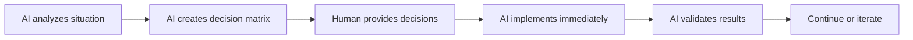

# Collaborative Decision Workflow Protocol

**Date:** 2024-12-19  
**Status:** ACTIVE PROTOCOL  
**Context:** Optimized AI-Human collaboration pattern  

## 🎯 PROVEN WORKFLOW PATTERN

### The Decision-Action Cycle



### Key Success Factors:

1. **Structured Decision Documents**
   - Clear options (A/B/C format)
   - Pros/cons for each option
   - Technical implications explained
   - Decision template provided

2. **Immediate Implementation**
   - No delays after decisions received
   - AI takes full responsibility for implementation
   - Continuous progress updates
   - Results validation included

3. **Context Preservation**
   - Document decision rationale
   - Track implementation sessions
   - Maintain progress visibility
   - Enable easy resumption

## 🔄 INTEGRATION WITH WORKSPACE MODE SYSTEM

This workflow should be **built into** the workspace mode system we're implementing:

### New Mode: `[decide]`
- **Purpose:** Structured decision-making sessions
- **AI Behavior:** 
  - Creates comprehensive decision matrices
  - Provides technical analysis
  - Offers clear A/B/C options
  - Includes implementation templates
- **Human Role:** Provide decisions using structured format
- **Output:** Ready-to-implement action plan

### Enhanced `[discuss][meta]` Mode
- **Addition:** Decision workflow integration
- **AI Capabilities:**
  - Detect when decisions are needed
  - Auto-generate decision documents
  - Provide implementation readiness status
  - Track decision-implementation cycles

### CLI Commands to Add:
```bash
/decision create [topic]     # Generate decision matrix
/decision status             # Show pending decisions
/decision implement [id]     # Execute after decisions received
/workflow decision-cycle     # Start structured decision process
```

## 📋 IMMEDIATE CHANGES NEEDED

### 1. Update SES-004 Planning
Add decision workflow integration to workspace state system:

```json
{
  "decision_workflow": {
    "active_decision_session": "SES-004-DECISIONS",
    "pending_decisions": ["branch_strategy", "permission_granularity"],
    "decision_history": [],
    "auto_implement": true
  }
}
```

### 2. Enhance WorkspaceStateManager
Add decision tracking capabilities:
- Track pending decisions
- Link decisions to implementation sessions
- Auto-trigger implementation after decision receipt
- Maintain decision-outcome tracking

### 3. CLI Integration Enhancement
Modify planned CLI commands to include decision workflow:
- `/mode [decide]` - Enter decision-making mode
- `/decisions pending` - Show what needs decisions
- `/decisions implement` - Execute after receiving answers

## 🚀 ENHANCED SESSION PLANNING

### SES-004A: Now Includes Decision Workflow
**Original scope:** Workspace state system  
**Enhanced scope:** Workspace state + decision workflow integration

**Additional deliverables:**
1. Decision workflow integration in WorkspaceStateManager
2. CLI commands for decision management
3. Auto-implementation triggers
4. Decision-session linking

**Estimated time:** +1 hour (total: 4-5 hours)

### Benefits:
- **Productivity:** Immediate action after decisions
- **Clarity:** Structured decision process
- **Tracking:** Full decision-implementation audit trail
- **Repeatability:** Proven workflow pattern for future use

## 🎯 ACTION PLAN

**Right now:** 
1. Wait for your decisions on SES-004 matrix
2. Implement workspace state system WITH decision workflow integration
3. Test the enhanced collaborative pattern
4. Use this as template for all future complex decisions

**This becomes our standard operating procedure!** 

---

**STATUS:** ✅ Protocol established - ready to implement enhanced system
