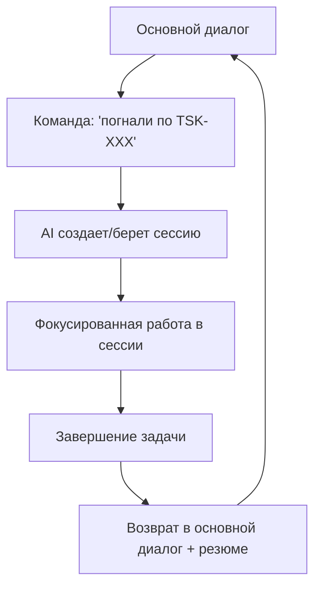

# Записка для @kpblcaoo (Михаил) и @momai (Саня)

**Дата:** 2024-12-19  
**Контекст:** [discuss] - планирование общего workflow  
**Статус:** Концептуальное планирование  
**Для:** Михаил Kpblc + Саня Мамай

---

## 🎯 Идея от @kpblcaoo (Михаил)

### Концепция "Эластичных Рабочих Сессий"

**Суть идеи:**
- Работаем в основном диалоге/ветке
- При появлении конкретной задачи/эпика говоришь: "погнали по такой-то задаче"
- AI создает новую сессию или берет существующую
- Фокусированно работаем в этой сессии до завершения
- Возвращаемся в основной диалог с кратким резюме выполненного

### 🔄 Предлагаемый Workflow



### 📋 Техническая реализация

#### 1. CLI команды для workflow
```bash
/go task TSK-XXX          # Переход к работе по задаче
/go epic EPIC-YYY         # Переход к работе по эпику  
/go session SES-ZZZ       # Переход к конкретной сессии
/back                     # Возврат в основной диалог с резюме
/status                   # Где мы сейчас находимся
```

#### 2. Структура состояний
```json
{
  "main_context": {
    "active_dialog": "main",
    "current_focus": null,
    "suspended_sessions": []
  },
  "active_session": {
    "session_id": "SES-XXX",
    "parent_context": "main",
    "focus_area": "TSK-165",
    "start_time": "2024-12-19T15:30:00Z"
  },
  "session_stack": [
    {
      "context": "main",
      "suspended_at": "discussing workspace modes",
      "resume_point": "waiting for decisions"
    }
  ]
}
```

#### 3. AI Memory Management
- **Основной контекст:** Общие планы, долгосрочные цели, архитектурные решения
- **Сессионный контекст:** Конкретная задача, техническая реализация, детали
- **Переход между контекстами:** Краткое резюме + ключевые инсайты

### 🎯 Преимущества

1. **Фокус:** Четкое разделение между планированием и реализацией
2. **Гибкость:** Легкое переключение между задачами
3. **Контекст:** AI помнит общую картину + детали конкретных сессий
4. **Эффективность:** Нет потери контекста при переключениях

### 🔧 Интеграция с существующими системами

#### Workspace Mode System
- Основной диалог: `[discuss][meta]` или `[plan]`
- Рабочие сессии: `[code]`, `[debug]`, `[docs]` и т.д.
- Автоматическое переключение режимов при смене контекста

#### Session Management
- Расширить `ai_sessions.json` поддержкой nested sessions
- Добавить session stack для возврата к предыдущим контекстам
- Интегрировать с `current_session.json`

#### Decision Workflow
- Решения в основном контексте → планирование
- Решения в сессиях → немедленная реализация
- Резюме решений при возврате в основной контекст

### 📝 Пример использования

```
[Основной диалог]
Мамай: "Нужно доработать workspace state system"
AI: "Понял. Есть несколько подзадач. Хочешь пройтись по каждой?"

Мамай: "Погнали по TSK-165"
AI: "Переключаюсь на SES-004A для TSK-165 workspace state implementation. 
     Режим: [meta][code]. Приостанавливаю основной диалог."

[Работаем в сессии...]

AI: "TSK-165 завершен. Возвращаюсь в основной диалог.
     РЕЗЮМЕ: Реализован WorkspaceStateManager, добавлена CLI интеграция, 
     система готова к тестированию. Следующие шаги: TSK-166."

[Снова в основном диалоге]
Мамай: "Отлично! Теперь погнали по TSK-166"
```

### 🚀 План реализации

#### Phase 1: Базовая функциональность (1-2 часа)
- Команды `/go` и `/back`
- Простое переключение контекстов
- Базовое резюме при возврате

#### Phase 2: Расширенные возможности (2-3 часа)
- Session stack для множественных переключений
- Автоматическое переключение workspace modes
- Интеллектуальное резюме с ключевыми инсайтами

#### Phase 3: Интеграция и оптимизация (1-2 часа)
- Полная интеграция с decision workflow
- Автоматическое сохранение контекста
- Аналитика эффективности сессий

### 💡 Дополнительные идеи

#### "Context Handoff Protocol"
При переключении AI предоставляет:
- **Current state:** Где мы остановились
- **Key decisions:** Что решили в процессе
- **Next steps:** Что планируем дальше
- **Blockers:** Что может помешать

#### "Smart Resume"
При возврате AI восстанавливает:
- **Progress summary:** Что сделано
- **New insights:** Что узнали
- **Updated context:** Как изменилось понимание задачи
- **Recommendations:** Что делать дальше

### 🎯 Итоговый вопрос

**Михаил + Саня, что думаете о такой концепции?**

Особенно интересны ваши мысли про:
1. Какие команды будут наиболее удобными?
2. Какой уровень детализации нужен в резюме?
3. Как лучше обрабатывать прерывания и множественные переключения?
4. Нужны ли автоматические предложения для перехода к задачам?
5. **Персонализация:** Как настроить workflow под каждого разработчика?

---

## 👤 ПЕРСОНАЛИЗАЦИЯ WORKFLOW

### Конфигурация пользователя
**Локация:** `.env` + `data/user_profiles/`

```bash
# .env - основные настройки
LLMSTRUCT_USER_NAME="kpblcaoo"
LLMSTRUCT_USER_ROLE="lead_architect" 
LLMSTRUCT_WORKFLOW_STYLE="rapid_prototyping"
LLMSTRUCT_DECISION_AUTHORITY="high"
LLMSTRUCT_NOTIFICATION_LEVEL="minimal"

# Если .env пустой - автоматические напоминания
LLMSTRUCT_SETUP_COMPLETED="false"
```

### Профили пользователей
**Файл:** `data/user_profiles/kpblcaoo.json`
```json
{
  "user_id": "kpblcaoo",
  "display_name": "Михаил",
  "role": "lead_architect",
  "preferences": {
    "workflow_style": "rapid_prototyping",
    "decision_matrix_detail": "comprehensive",
    "auto_implementation": true,
    "session_resumption": "full_context",
    "notification_style": "minimal_interrupts"
  },
  "permissions": {
    "auto_grant": ["filesystem", "network", "execution"],
    "requires_approval": ["system_packages", "production_deploy"],
    "emergency_override": true
  },
  "work_patterns": {
    "preferred_modes": ["[discuss][meta]", "[code][debug]"],
    "typical_session_length": "2-4 hours",
    "break_reminders": false,
    "context_switching": "elastic"
  }
}
```

### Auto-Setup при первом запуске
```bash
# Если .env пустой или SETUP_COMPLETED=false
/setup user-profile    # Интерактивная настройка
/setup quick          # Быстрая настройка с умолчаниями
```

---

**Статус:** 💭 Ждем обратной связи для финализации концепции
